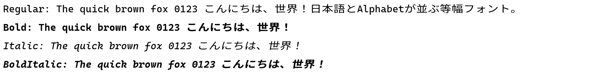

# serein



[Cascadia Mono](https://github.com/microsoft/cascadia-code)（欧文・半角）と
[Noto Sans JP](https://github.com/notofonts/noto-cjk)（和文・全角）を合成した、
プログラミング向け等幅フォントです。全角文字の幅は半角文字のちょうど 2 倍になっています。

- Regular / Bold / Italic / Bold Italic の 4 スタイル
- 半角:全角 = 1:2

## ダウンロード・インストール

ビルド済みフォントは [GitHub Releases](https://github.com/ya-somada/serein/releases) で配布します。
リリース公開後、各リリースの「Assets」からフォントをダウンロードしてください。

Windows ではダウンロードした TTF を右クリックして「インストール」を選び、
エディターのフォント名を `serein` に設定します。
配布用の [LICENSE.txt](LICENSE.txt) を同梱しており、各 TTF 内にも
著作権表示と OFL 1.1 の全文を収録しています。

## ビルド方法

必要なもの:

- Python 3 + [fonttools](https://pypi.org/project/fonttools/)
- [FontForge](https://fontforge.org/)（`ffpython` が使えること）

```powershell
python scripts/01_instance_noto.py   # Noto Sans JP の可変フォントから Regular/Bold を書き出す
& "C:\Program Files\FontForgeBuilds\bin\ffpython.exe" scripts/02_ffscript.py  # 幅・メトリクスを揃えて中間ファイルを生成
python scripts/03_merge_fix.py       # fontTools で合成し、OS/2 等のテーブルを調整
```

生成される中間ファイルは `build/`、最終成果物は `dist/` に出力されます。
`build/` と `dist/` は Git 管理対象外です。
公開前に以下の検証を実行してください。

```powershell
python scripts/04_verify.py
```

検証後、`dist/` の TTF と `LICENSE.txt` を GitHub Releases の配布物として添付します。

## 仕組み

1. `01_instance_noto.py`: Google Fonts が配布する Noto Sans JP の可変フォント
   (`NotoSansJP[wght].ttf`) から Regular(400) / Bold(700) の静的インスタンスを書き出す。
2. `02_ffscript.py`（FontForge）: Noto Sans JP 側の em を Cascadia Mono に合わせ、
   Cascadia 側に既にあるコードポイント（英数字・記号・罫線など）は Noto 側から削除。
   同じ字形を共有する別のコードポイントは残す。
   残った日本語グリフの幅を「半角 = Cascadia の半角幅」「全角 = その2倍」にきっちり揃える。
   ひらがな・カタカナ・漢字の角は `corner_round.py` の処理で少し丸める
   （`JP_CORNER_RADIUS_RATIO` で強さを調整可能。em に対する半径の比率で指定、既定値 0.06）。
   イタリック系スタイルでは日本語グリフも疑似的に傾ける。
3. `03_merge_fix.py`（fontTools）: 幅・メトリクスを揃えた 2 つの中間フォントを
   `fontTools.merge` で 1 つに合成し、OS/2 (xAvgCharWidth, fsSelection, weight,
   panose)・post (isFixedPitch)・head (macStyle)・name テーブルを
   "serein" として整える。Cascadia 由来の結合文字の幅を元の 0 に戻し、
   著作権表示・ライセンス全文を埋め込んで `LICENSE.txt` を同梱する。

## ライセンス

[LICENSE.txt](LICENSE.txt) を参照してください。Cascadia Code と Noto Sans JP は
いずれも SIL Open Font License 1.1 で配布されており、本フォントも同ライセンスに
従います。
